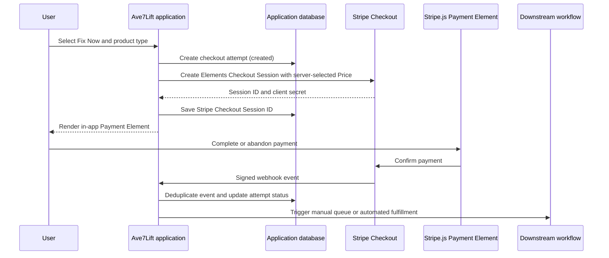

# From "Fix Now" checkout to payment management

## Decision summary

The fastest production-oriented path is a **Fix Now** checkout: a signed-in user selects an eligible product or service for a specific item, the server creates a Stripe Checkout Session, and a verified webhook records the outcome in the application database. The application never stores card numbers, CVCs, or raw payment details.

This is a small extension of the POC's Payment Element with Checkout Sessions path. It is sufficient to collect a payment in-app, retain a durable business record, and trigger a manual or automated downstream process. Customer billing management, payment-method display, subscriptions, invoices, refunds, and order history can be added later through Stripe APIs and the Stripe Customer Portal.

## Phase 1: Fix Now MVP

### Customer experience

1. A user views an eligible item or issue.
2. They select **Fix Now**.
3. They choose an allowed product type, such as a one-time service or recurring plan.
4. The application displays a review page with the item, selected product, price, and currency.
5. The user selects **Continue to secure payment**.
6. The server creates a Stripe Checkout Session with `ui_mode="elements"` and returns the client secret to the in-app Payment Element.
7. Stripe.js confirms the payment and returns the user to an application confirmation page.
8. A verified Stripe webhook updates the checkout attempt. The application can show a pending, paid, failed, or action-required state.

The review page should receive a product identifier, not a browser-supplied amount. The server maps that identifier to an allowed Stripe Price ID and calculates or looks up all pricing server-side.

### Minimal application records

Store business references and Stripe identifiers, not financial details:

| Record | Required fields | Why it exists |
| --- | --- | --- |
| `product_selection` | Internal product key, Stripe Price ID, display name, currency, active flag | Server-side allowlist of products a user may buy |
| `checkout_attempt` | Internal ID, user/account ID, target item ID, selected product key, amount/currency snapshot, status, created/completed timestamps, Stripe Checkout Session ID | Connects a customer action to the business object being fixed |
| `stripe_payment_reference` | Checkout Session ID, PaymentIntent ID when present, Subscription ID when present, Stripe Customer ID when present, payment status | Enables reconciliation and support without card storage |
| `webhook_event` | Stripe Event ID, event type, received timestamp, processing status | Provides idempotency and an audit trail for retries |
| `fulfillment_action` | Checkout attempt ID, action type, state, requested/completed timestamps | Allows a person or background worker to act only after payment is confirmed |

Use opaque internal IDs in Stripe metadata, for example `account_id`, `target_item_id`, `checkout_attempt_id`, and `product_key`. Do not place sensitive data in metadata. Include the same checkout-attempt ID in `client_reference_id` when suitable.

### Minimal status model

| Application status | Meaning | Typical source |
| --- | --- | --- |
| `created` | User began checkout; no Stripe Session yet | Application |
| `checkout_open` | Stripe Checkout Session created | Stripe API response |
| `payment_pending` | Payment needs asynchronous confirmation | Stripe webhook |
| `paid` | Payment succeeded and downstream work can begin | Verified completion/success webhook |
| `failed` | Payment failed or was canceled | Stripe webhook or Session lookup |
| `fulfilled` | Manual or automated Fix Now action completed | Application workflow |

The exact Stripe event set depends on enabled payment methods. At minimum, process `checkout.session.completed`; add asynchronous payment success/failure events before enabling delayed payment methods.

### Required safeguards

- Authenticate the user and authorize access to the item before a checkout attempt is created.
- Use server-side product/Price mapping. Never trust an amount, Stripe Price ID, account ID, or target item ID supplied by the browser.
- Create an application checkout attempt before calling Stripe and use an idempotency key to prevent duplicate Sessions when users double-click or retry.
- Verify webhook signatures, store Stripe Event IDs, and make webhook processing idempotent.
- Treat webhooks, not the success-page redirect, as payment authority.
- Keep Stripe secret keys in a secrets manager; restrict production keys and rotate them when needed.
- Log and alert on webhook delivery/processing failures.

## Phase 2: account billing and order history

Once Fix Now is proving value, add customer billing capabilities without storing cards:

| Capability | Stripe responsibility | Application responsibility |
| --- | --- | --- |
| Saved payment methods | Stripe stores and tokenizes payment methods | Store only the Stripe Customer ID; optionally display Stripe-provided summary data |
| Billing details page | Stripe Customer Portal manages payment methods, invoices, and subscriptions | Create authenticated Portal Sessions and provide a navigation link |
| Order history | Stripe is the payment authority | Display local checkout attempts plus synchronized Session, PaymentIntent, Invoice, and Subscription references |
| Subscription management | Stripe Billing and Customer Portal | Map plans to Stripe Prices and react to subscription webhooks |
| Refunds and support | Stripe executes the refund | Enforce staff authorization, capture a support reason, and record the result |
| Automated fulfillment | Stripe confirms payment | Queue and execute the Fix Now action, then record fulfillment status |

The first version of an account billing page can be a simple **Manage billing** button that opens a Stripe Customer Portal session. This avoids implementing card editing, invoice PDFs, cancellation workflows, and subscription changes in the application.

## Phase 3: full payment management

A more mature payment platform adds:

- Product catalog administration, pricing rules, discounts, taxes, and entitlements.
- Robust order lifecycle and fulfillment orchestration.
- Subscription upgrades, downgrades, cancellation policy, trials, and dunning.
- Invoices, refunds, disputes, reconciliation, and finance reporting.
- Role-based operations tooling and audit trails.
- Production webhook event queueing, retry strategy, dead-letter handling, monitoring, and alerting.
- Privacy/security reviews, data-retention policies, and production incident runbooks.

## Effort and value framing

| Stage | What users can do | What the business learns | Relative effort |
| --- | --- | --- | --- |
| **POC now** | Complete four Sandbox payment demonstrations | Which Stripe integration experience best fits Ave7Lift | Low |
| **Fix Now MVP** | Select a product for an item and pay securely | Whether users will pay and which services convert | Low-medium |
| **Billing and history** | Manage billing through Stripe and see purchase history | Retention, subscription behavior, and support needs | Medium |
| **Full payment management** | Manage the complete commerce lifecycle in-app | Scalable revenue operations and automation | High |

The recommended immediate investment is **Fix Now MVP using Payment Element with Checkout Sessions**. It builds on the POC's custom in-app checkout path, preserves Stripe as the system that collects payment details, and adds only the application records needed to connect a confirmed payment to a downstream action.
