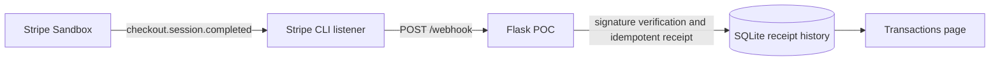
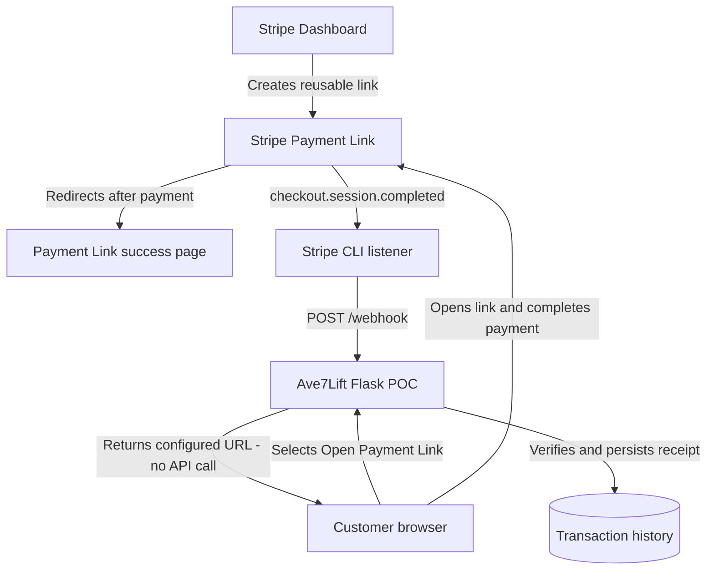
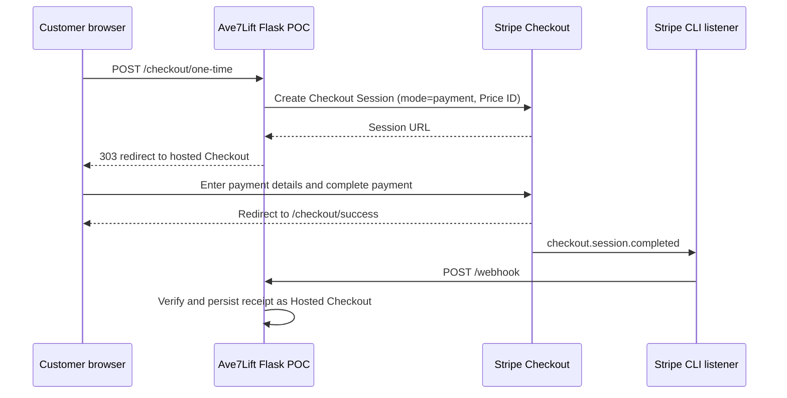
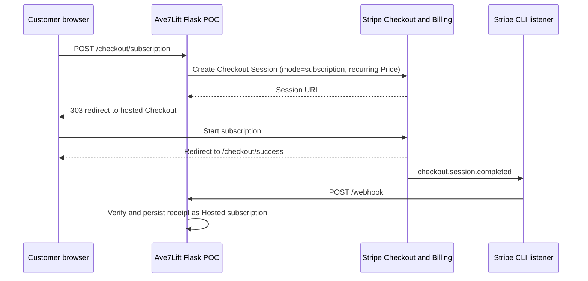
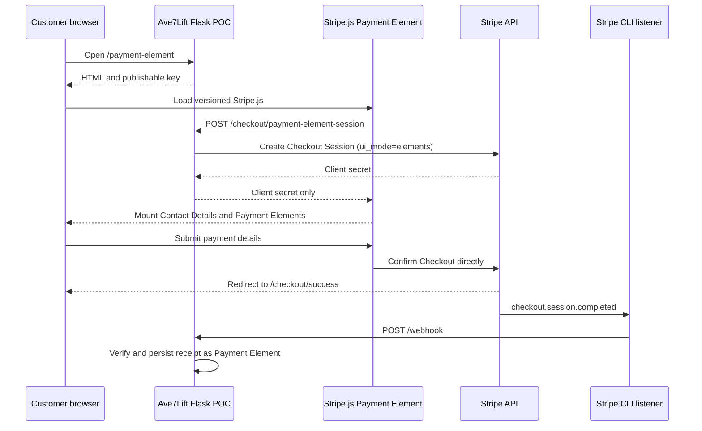

# Ave7Lift Stripe POC technical whitepaper

## Executive summary

The Ave7Lift Stripe proof of concept demonstrates four progressively more integrated ways to collect payments in a Python application. The goal is to make the trade-off between speed, checkout ownership, and implementation responsibility tangible in a working Stripe Sandbox application.

The POC deliberately keeps payment data outside the Flask server. Stripe-hosted pages or Stripe.js collect sensitive payment details, and the application treats the `checkout.session.completed` webhook as the reliable payment-completion signal. Browser redirects are for customer experience only; they are not fulfillment signals.

## Goals

1. Demonstrate the fastest Stripe integration path, from Dashboard configuration to a custom in-app payment form.
2. Keep the implementation compact, readable, and runnable locally with Stripe Sandbox credentials.
3. Use server-controlled Price IDs and a server-side secret key for all programmatic Checkout Session creation.
4. Prove reliable post-payment processing with signature-verified webhooks and persistent local receipt history.
5. Make it easy to compare each path during a technical or product demonstration.

## Non-goals

This is an MVP/POC, not a production commerce platform. It does not implement inventory, orders, tax calculation, refunds, customer account management, production hosting, authentication, or a fulfillment system. The transaction history records received webhook receipts rather than becoming a system of record.

## Common architecture

The Flask application exposes the demo home page, payment endpoints, completion pages, webhook endpoint, and a transactions page. Configuration is provided through environment variables:

| Variable | Purpose |
| --- | --- |
| `STRIPE_SECRET_KEY` | Server-side Sandbox secret or restricted key |
| `STRIPE_PUBLISHABLE_KEY` | Browser-safe key used by the Payment Element |
| `STRIPE_ONE_TIME_PRICE_ID` | One-time Stripe Price used for payment demos |
| `STRIPE_SUBSCRIPTION_PRICE_ID` | Recurring Stripe Price used for subscriptions |
| `STRIPE_PAYMENT_LINK_URL` | Dashboard-created Payment Link |
| `STRIPE_WEBHOOK_SECRET` | Signature secret provided by the local Stripe CLI listener |
| `STRIPE_API_VERSION` | Server API version; defaults to `2026-03-25.dahlia` |

`start.sh` starts Flask and `stripe listen --forward-to localhost:4242/webhook`. The listener forwards Stripe Sandbox events to Flask. The webhook handler verifies the `Stripe-Signature`, stores one receipt per Checkout Session ID in SQLite, and classifies new receipts by POC option. This makes delivery idempotent when Stripe retries an event.

## Option 1: Payment Link

### How it was built

The Payment Link is created and configured in the Stripe Dashboard. Stripe owns the product, price, hosted checkout page, and reusable link. The Flask home page only renders the configured `STRIPE_PAYMENT_LINK_URL`; it makes no API request when a customer opens the link.

The Payment Link is configured in the Dashboard to redirect after successful payment to `/payment-link/success`, which provides a **Return to demo** action. The redirect configuration is a Dashboard setting, not application code.

### How it works

### Key characteristic

This is the no-code integration. It is ideal for demonstrations, marketing pages, email campaigns, and simple product sales where a reusable Stripe-managed link is sufficient.

## Option 2: Hosted Checkout one-time payment

### How it was built

The Flask endpoint `POST /checkout/one-time` uses the Stripe Python SDK to create a Checkout Session with `mode="payment"`, a server-controlled one-time Price ID, a success URL, and a cancel URL. The endpoint redirects the browser to the Session URL returned by Stripe.

The app adds `metadata.poc_option=hosted-checkout` to the Session. That metadata lets the webhook receipt history distinguish this path from the other payment-mode sessions.

### How it works

### Key characteristic

This is the simplest programmatic integration. The application controls when a transaction begins and which server-owned Price is used, while Stripe hosts payment collection, payment-method selection, and authentication.

## Option 3: Hosted Checkout subscription

### How it was built

The Flask endpoint `POST /checkout/subscription` uses the same Checkout Session integration as the one-time path. Its two meaningful differences are:

- It uses `mode="subscription"`.
- It passes a recurring `STRIPE_SUBSCRIPTION_PRICE_ID`.

The Session is classified as a hosted subscription in webhook history. No separate subscription-specific checkout UI or client JavaScript is required.

### How it works

### Key characteristic

This demonstrates that recurring billing can use nearly the same low-code Checkout integration as one-time payment. Stripe Billing manages the subscription after its creation.

## Option 4: Payment Element with Checkout Sessions

### How it was built

This is the custom in-app checkout path. Flask creates a Checkout Session with `mode="payment"` and `ui_mode="elements"`, then returns only the Session `client_secret` to the browser. The client loads versioned Stripe.js from `https://js.stripe.com/dahlia/stripe.js`, which matches the app's server-side API release train.

Stripe.js initializes the Checkout Elements SDK with the client secret, mounts a Contact Details Element and a Payment Element, then calls `actions.confirm()` after the customer submits the form. The Contact Details Element supplies the email Checkout requires. All card collection stays in Stripe-hosted iframes.

### How it works

### Key characteristic

This path provides the most control over on-page checkout presentation among the implemented options. It adds browser-side Stripe.js integration, client-secret handling, form lifecycle handling, and version alignment, while retaining Checkout Sessions' higher-level payment and subscription capabilities.

## Operational and security observations

- Test only with Stripe Sandbox credentials and Stripe test payment methods.
- Never commit `.env`, the local SQLite receipt database, the Stripe listener log, or virtual environment files.
- Use the `price_...` Price ID, not the `prod_...` Product ID, for programmatic Checkout Sessions.
- Treat Payment Link and Checkout completion redirects as customer navigation, not payment authority.
- Build production fulfillment around verified webhooks and persistent business records rather than the POC's receipt table.
- The local Stripe CLI listener is a development tool. A production deployment needs a publicly reachable HTTPS webhook endpoint configured in Stripe.

## Final comparison: the four implemented options

| Option | Pros | Cons |
| --- | --- | --- |
| **1. Payment Link** | Fastest path; no payment API code; Dashboard-managed; reusable/shareable URL; Stripe hosts checkout. | Least runtime control; products, price, and post-payment behavior are configured in Dashboard; no app-created Session at click time; limited custom experience. |
| **2. Hosted Checkout payment** | Small Flask implementation; server controls the Price and transaction start; Stripe handles card collection, authentication, and hosted UI; clear redirect flow. | Customer leaves the application for checkout; less visual control than an embedded form; requires server endpoint and secret key. |
| **3. Hosted Checkout subscription** | Nearly identical implementation to one-time Checkout; recurring Price and `subscription` mode enable Billing; Stripe manages subscription checkout. | Customer still leaves the application; subscription lifecycle management needs further work for production; recurring product configuration is required. |
| **4. Payment Element with Checkout Sessions** | Branded in-app payment experience; Stripe.js still keeps payment data off the Flask server; Checkout Sessions retain high-level features; supports direct UI customization. | Most implementation complexity of the four; requires browser-side Stripe.js, client-secret flow, contact collection, error handling, and server/Stripe.js version alignment. |
